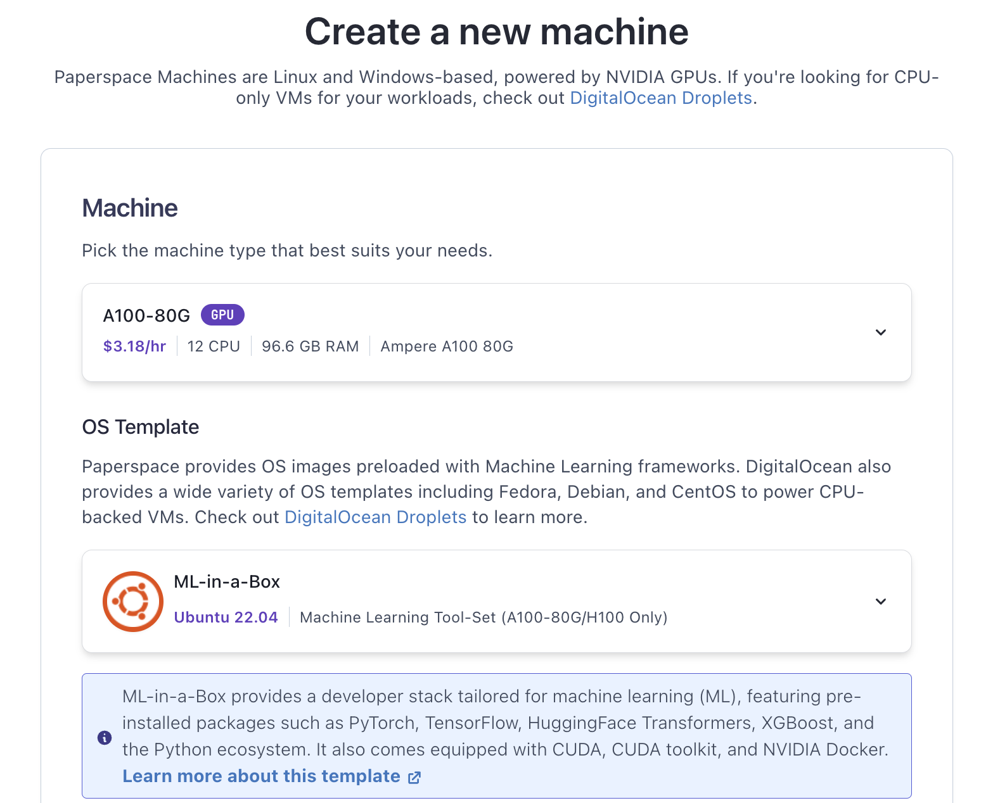

# NeMoLangChainOllamaGradio

()(NeMo LangChain Ollama Gradio) for NVIDIA GenAI Contest

<https://www.nvidia.com/en-us/ai-data-science/generative-ai/developer-contest-with-langchain/terms-and-conditions/>

## Desired and Required Libraries

- nemoguardrails==0.9.0
- langchain-community==0.0.38
- ollama==0.2.1
- gradio==4.36.1
- python-dotenv==1.0.1

## Step 1: Set Up Your Environment

1. **Hardware Requirements**: Ensure you have access to NVIDIA GPUs, ideally A100 80GB VRAM, to run the model (Llama3:70b) efficiently. In my case I rent A100 GPU from Digital Ocean Paperspace. Please see the screenshot. OS: Ubuntu 22.04 Disk Size: At least 200 GB (llama3:70b)-> 40GB, (llama3:8b)-> 5GB

   

   ```bash
   ssh paperspace@XXX.XXX.XXX.XXX
   ```

1. First git clone the repository

   ```bash
   cd ~
   git clone git@github.com:aidatatools/NeMoLangChainOllamaGradio.git
   cd NeMoLangChainOllamaGradio
   ```

1. **venv**:

   Ensure you have Python 3.10 or later installed.

   ```bash
   cd ~/NeMoLangChainOllamaGradio
   python3.10 -m venv venv
   source venv/bin/activate
   ```

1. Install requirements.txt

   ```bash
   pip install -r requirements.txt
   ```

1. Check the backend **ollama** service is running, and the model (llama3:8b)(for DEV) or (llama3:70b)(for Production) exists. If you are not familiar with ollama, please visit <https://ollama.com>

   ```bash
   ollama list
   curl http://127.0.0.1:11434
   ```

1. Copy .env.example to .env and set the variable(ENV_PROD) to True or False

   ```bash
   echo 'ENV_PROD=False' > .env
   ```

## Step 2: Start the Web UI to Interact with Chatbot

1. Start the WebUI in terminal:

   ```bash
   python chatbot3.py
   ```

1. Open a browser, and visit the site with port number:

   <http://127.0.0.1:7860>

## Reference

- [Safeguarding LLMs with Guardrails](https://towardsdatascience.com/safeguarding-llms-with-guardrails-4f5d9f57cff2)
- [LlamaGuard-based Moderation Rails Performance](https://github.com/NVIDIA/NeMo-Guardrails/blob/develop/docs/evaluation/README.md#llamaguard-based-moderation-rails-performance)
- <https://github.com/NVIDIA/NeMo-Guardrails>
-
